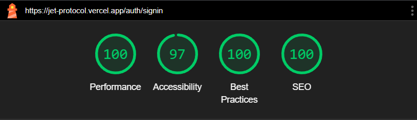

# Jet Protocol

## Live Demo

[https://jet-protocol.vercel.app/](https://jet-protocol.vercel.app/)

## Description

Jet Protocol is an internship assignment project for TweepBooks. It is a web application built with Next.js, React Query, Tailwind CSS, Next SEO, and uses Supabase as the backend. The project is hosted on Vercel.

## Table of Contents

- [Installation](#installation)
- [Technologies Used](#technologies-used)
- [About the App](#about-the-app)
- [Explaning the Codebase](#explaining-the-codebase)

## Installation

To run the Jet Protocol project locally, follow these steps:

1. Clone the repository from GitHub:

```bash
git clone https://github.com/chirag-chhajed/jet-protocol
```

2. Install the dependencies:

```bash
npm install
```

3. Create a `.env.local` file in the root directory of the project and add the following environment variables:

```env
NEXT_PUBLIC_SUPABASE_URL=<supabase_url>
NEXT_PUBLIC_SUPABASE_ANON_KEY=<supabase_anon_key>
```

4. Run the development server:

```bash
npm run dev
```

## Technologies Used

- [Next.js](https://nextjs.org/)
- [React Query](https://react-query.tanstack.com/)
- [Tailwind CSS](https://tailwindcss.com/)
- [Next SEO](https://www.npmjs.com/package/next-seo)
- [Supabase](https://supabase.com/)
- [Vercel](https://vercel.com/)

## About the App

- **Landing Page**


It's a completely static page. I have tried to make it responsive. I have used Tailwind CSS for styling. I have used Next SEO to add meta tags to the page and also added an Open Graph image.

- **Auth Pages**



The authentication pages include both Sign In and Sign Up pages. They are responsive and utilize Supabase for authentication. To ensure security, email verification is required for new sign-ups.

- **Movies Page**


The Movies page is accessible only to authenticated users. It displays a list of movies fetched from an API using React Query. The page features Infinite Scroll, allowing users to load new movies as they reach the end of the page. Additionally, Next SEO has been implemented to optimize the page with meta tags and an Open Graph image.

-- **Movie Detail Page**


The Movie Detail page is accessed by clicking on a movie title from the Movies page. It provides detailed information about the selected movie.

The project uses Tailwind CSS for styling, providing a modern and visually appealing user interface.

## Explaining the Codebase

The codebase of Jet Protocol follows the Next.js Pages directory structure. Initially, the project used the "app" directory, but due to some issues, it was moved to the "pages" directory.

To fetch data from various APIs, a combination of Axios and React Query is used. The project implements functions and custom hooks to write boilerplate code for fetching different APIs, ensuring code reusability and avoiding repetition.

```ts
// src/lib/axios-config.ts
// axios config for base url and api key
import axios from "axios";

const instance = axios.create({
  baseURL: "https://api.themoviedb.org",
  params:{
    api_key: process.env.API_KEY
  }
});

export default instance;

```

```ts
// src/hooks/api/post.ts
import { useQuery, useInfiniteQuery } from "@tanstack/react-query";
import * as api from "@/api/posts";

export const useMovieDetail = (id: string) => {
  return useQuery({
    queryKey: ["detail", id],
    queryFn: () => api.getMovieDetail(id),
  });
};

export const useMovies = () => {
  return useInfiniteQuery(
    ["movies"],
    ({ pageParam }) => api.getMovies(pageParam),
    {
      getNextPageParam: (lastPage) => {
        const nextPage = lastPage.page + 1;
        if (nextPage <= lastPage.total_pages) {
          return nextPage;
        } else {
          return undefined;
        }
      },
    }
  );
};

```

Additionally, the project leverages Server-Side Rendering (SSR) at various places to optimize the initial loading performance and improve SEO.
Moreover, the project uses a custom `useScrollPosition` hook to implement infinite scrolling on the Movies page. This custom hook is designed with reusability in mind, allowing its potential usage in other pages for infinite scroll functionality.

